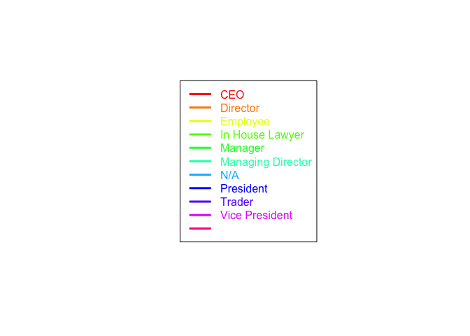
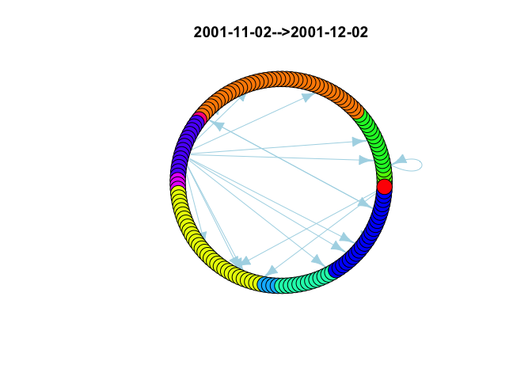
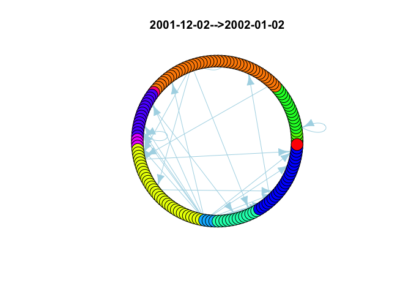

Introduction
============

In this post, our goal is to study the famous Enron scandal in 2001 (more information [here](https://en.wikipedia.org/wiki/Enron_scandal)), particularly by exploring the company mails during the period before it has been declared bankrupt. We will establish a hypothesis. Then, we will analyze the emails (that can be downloaded through internet) using <code>R</code>. More information about the emails [here](https://en.wikipedia.org/wiki/Enron_Corpus).

Obviously, other assumptions can be made. However, this post intends rather to show an example of a network based data analysis.

Important dates
===============

Here are some key dates for the Enron case: - On 09/10/2001, Goldman Sachs described Enron as "best of the best". - On 29/10/2001, Enron's CEO asked Commerce Secretary Donald Evans if he could influence Moody's rating agency, which has degraded his company's long-term debt rating. Evans believes he can not intervene. - On 31/10/2001, the SEC (the gendarme of the American stock exchange) opens an investigation. - On 02/12/2001, the multinational company declared itself bankrupt.

Our hypothesis
==============

One of the hypotheses we want to explore is that there was a change in communication within Enron in the crisis period. In other words, we think that there was a change in the behavior of email sending according to the functions of the actors at Enron (employee, manager, manager...). We know that an investigation was opened on Enron on 31/10/2001 and that Enron was declared in bankruptcy on 02/12/2001. We therefore decided to study the evolution of Enron's email over a 9-month period from 02/05/2001 to 02/02/2002 in 9 datasets (one month each).

On each of these sub-periods, we visualize the 20 "strongest" communications (in number of emails). It should be noted that taking the 20 first is not objectively adequate, but it compensates for the presence or absence of employees, the number of employees, vacations, etc. It should also be noted that we have also noticed a peak in the number of communication during the period of "crisis", but that we do not take this into account. We have stated our hypothesis. Let's do the analysis.

Data loading
============

Let's load the Enron dataset (you may download it <a href="{{ site.baseurl }}/dev/enron/data/EnronExtract.Rdata">here</a>). Note: you can find the full Enron dataset in the internet. Fur the purpuse of this work, we only use an extract.

``` r
# data loading
wdPath = 'data/'
load(paste(wdPath, 'EnronExtract.Rdata', sep = ""))
```

It contains the following dataframes from which the "employeelist" dataframe (employe id, name, emails, ...), the "messageWithoutBody" dataframe (message id, sender, ...) and "recipientinfo" dataframe (message id, reciever, ...). Here is an overview of these dataframes.

``` r
head(employeelist)
```

    ##   eid firstName lastName                Email_id
    ## 1  13     Marie    Heard   marie.heard@enron.com
    ## 2   6      Mark   Taylor mark.e.taylor@enron.com
    ## 3  19     Lindy   Donoho  lindy.donoho@enron.com
    ## 4 115      Lisa     Gang     lisa.gang@enron.com
    ## 5 129   Jeffrey Skilling jeff.skilling@enron.com
    ## 6  18      Lynn    Blair    lynn.blair@enron.com
    ##                       Email2             Email3 EMail4     folder   status
    ## 1                                                         heard-m     <NA>
    ## 2      mark.taylor@enron.com e.taylor@enron.com          taylor-m Employee
    ## 3          ldonoho@enron.com                             donoho-l Employee
    ## 4                                                          gang-l      N/A
    ## 5 jeffrey.skilling@enron.com                           skilling-j      CEO
    ## 6        lynnblair@enron.com                              blair-l Director

``` r
message = messageWithoutBody
head(message)
```

    ##   mid                    sender       date
    ## 1  52   press.release@enron.com 2000-01-21
    ## 2  53 office.chairman@enron.com 2000-01-24
    ## 3  54 office.chairman@enron.com 2000-01-24
    ## 4  55   press.release@enron.com 2000-02-02
    ## 5  56 office.chairman@enron.com 2000-02-07
    ## 6  57          foothi19@idt.net 2000-08-25
    ##                                      message_id
    ## 1 <12435833.1075863606729.JavaMail.evans@thyme>
    ## 2 <29664079.1075863606676.JavaMail.evans@thyme>
    ## 3 <15300605.1075863606629.JavaMail.evans@thyme>
    ## 4 <10522232.1075863606538.JavaMail.evans@thyme>
    ## 5 <16056123.1075863606515.JavaMail.evans@thyme>
    ## 6 <31680362.1075863730221.JavaMail.evans@thyme>
    ##                                                                               subject
    ## 1 ENRON HOSTS ANNUAL ANALYST CONFERENCE PROVIDES BUSINESS OVERVIEW AND GOALS FOR 2000
    ## 2                                                     Over $50 -- You made it happen!
    ## 3                                                     Over $50 -- You made it happen!
    ## 4                 ROAD-SHOW.COM Q4i.COM CHOOSE ENRON TO DELIVER FINANCIAL WEB CONTENT
    ## 5                                                        Fortune Most Admired Ranking
    ## 6                                                   WPTF Friday Credo Veritas Burrito
    ##                                             folder
    ## 1 Robert_Badeer_Aug2000Notes FoldersPress releases
    ## 2 Robert_Badeer_Aug2000Notes FoldersPress releases
    ## 3 Robert_Badeer_Aug2000Notes FoldersPress releases
    ## 4 Robert_Badeer_Aug2000Notes FoldersPress releases
    ## 5 Robert_Badeer_Aug2000Notes FoldersPress releases
    ## 6    Robert_Badeer_Aug2000Notes FoldersNotes inbox

``` r
head(recipientinfo)
```

    ##   rid mid rtype                            rvalue
    ## 1  67  52    TO           all.worldwide@enron.com
    ## 2  68  53    TO            all.downtown@enron.com
    ## 3  69  54    TO     all.enron-worldwide@enron.com
    ## 4  70  55    TO           all.worldwide@enron.com
    ## 5  71  56    TO all_enron_north.america@enron.com
    ## 6  72  56    TO       ec.communications@enron.com

Some functions used in this analysis
====================================

We present here a list of functions that we build in order to make the code that will follow them easier to read. Here are the function.

``` r
# this function allows to build a name from a single mail.
buildNodeName <- function(x){
 paste(x[2],x[3],collapse=' ')
}
```

``` r
# this function allows to retrieve the different statuses.
getStatus <- function(){
 employeeStatus = unique(employeelist$status)
 return(employeeStatus)
}
```

``` r
# this function makes it possible to build a vector that assigns a number to each status
getClsEmployeeStatus <- function(){
 employeeStatus = getStatus()
 clsEmployeeStatus <- numeric()
 for(i in 1:nrow(employeelistSortByStatus)){
 if(is.na(employeelistSortByStatus$status[i]))
 clsEmployeeStatus[i] = which(is.na(employeeStatus))
 else
 clsEmployeeStatus[i] = which(employeeStatus == employeelistSortByStatus$status[i])
 }
 return(clsEmployeeStatus)
}
```

``` r
# this function is used to initialize the employee adjacency matrix.
initializematriceEmployee <- function(){
 nbEmployee = nrow(employeelist)
 matriceEmployee = matrix(0,nbEmployee,nbEmployee)
 names = apply(employeelist,1,function(x) buildNodeName(x))
 colnames(matriceEmployee) = rownames(matriceEmployee) = names
 return(matriceEmployee)
}
```

``` r
# this function is used to obtain the adjacency matrix of the employees according to a start and end date and the emails of this period.
buildmatriceEmployee <- function(debut, fin){
 sel = which(message$date >= debut & message$date < fin)
 mid = message$mid[sel]
 # reinitialize the global matrix
 matriceEmployee <- initializematriceEmployee()
 for (i in 1:length(sel)){
   # search for the email and the name of the sender
   x = which(message$sender[sel[i]] == employeelistSortByStatus$Email_id |
   message$sender[sel[i]] == employeelistSortByStatus$Email2 |
   message$sender[sel[i]] == employeelistSortByStatus$Email3 |
   message$sender[sel[i]] == employeelistSortByStatus$EMail4)
   # if the sender is known, search for the receiver
   if (length(x) != 0){
     id = mid[i]
     ind = which(recipientinfo$mid == id)
     for (j in 1:length(ind)){
       y = which(recipientinfo$rvalue[ind[j]] == employeelistSortByStatus$Email_id |
        recipientinfo$rvalue[ind[j]] == employeelistSortByStatus$Email2 |
        recipientinfo$rvalue[ind[j]] == employeelistSortByStatus$Email3 |
        recipientinfo$rvalue[ind[j]] == employeelistSortByStatus$EMail4)
       if (length(y) != 0) matriceEmployee[x,y] = matriceEmployee[x,y] + 1
     }
   }
 }
 return(matriceEmployee)
}
```

Analysis and visualization
==========================

Here, we sort the employees according to their status.

``` r
# employeelistSortByStatus sorts employees by their status
employeelistSortByStatus = employeelist[with(employeelist, order(status)),]
```

We then select 10 dates for building 9 periods.

``` r
dates = c("2001-05-02","2001-06-02","2001-07-02","2001-08-02","2001-09-02",
 "2001-10-02","2001-11-02","2001-12-02","2002-01-02","2002-02-02")
```

For each period, we build the [adjacency matrix](https://en.wikipedia.org/wiki/Adjacency_matrix) that we store in a file (to allow us to redo the treatment later if necessary). Note: the function "buildmatriceEmployee" is given in the Appendix at the end of this document.

``` r
# for each period, ...
for(i in 1:(length(dates)-1)){
 # build the adjacency matrix
 matriceEmployee <- buildmatriceEmployee(dates[i], dates[i+1])
 fileName = paste(wdPath, "Enron", dates[i], dates[i+1], sep="_")
 fileName = paste(fileName, "Rdata", sep = '.')
 save(matriceEmployee,file = fileName)
}
```

We create the color palette (as many colors as there are statuses) and a vector of number corresponding to the different statuses. Note: the function "getClsEmployeeStatus" is given in the Appendix at the end of this document.

``` r
# build the status vector and color palette
vectStatus = unique(employeelistSortByStatus$status)
paletteColor = rainbow(length(vectStatus))
clsEmployeeStatus = getClsEmployeeStatus()
```

We then load a visualization library

``` r
# visualization library
library(igraph)
```

    ## 
    ## Attaching package: 'igraph'

    ## The following objects are masked from 'package:stats':
    ## 
    ##     decompose, spectrum

    ## The following object is masked from 'package:base':
    ## 
    ##     union

``` r
par(mfrow=c(1,2))
```

Finally, we visualize in "circle" of the 20 strongest communications between the actors of Enron. Thus, as each status corresponds to a color, it will be possible to see which statuses communicate the most.

``` r
# visualisation parameters
numberExchangeKept = 20

# for each period, ...
for(i in 1:(length(dates)-1)){
 # graph legend
 plot.new()
 legend("center", legend = vectStatus, col = paletteColor,
 ncol = 1, cex = 1, lwd = 3, text.font = 1, text.col = paletteColor)

 # file loading
 fileName = paste(wdPath, "Enron", dates[i], dates[i+1], sep="_")
 fileName = paste(fileName, "Rdata", sep = '.')
 load(fileName)

 # threshold calculation of 'numberExchangeKept' most massive exchanges
 vectorEmployee = as.vector(matriceEmployee)
 seuil = tail(sort(vectorEmployee),numberExchangeKept)[1]

 # matrix transformation
 Xbis = (matriceEmployee >= seuil) + 0

 # graphe handling
 gbis = graph.adjacency(Xbis)
 gbis$layout <- layout.circle
 V(gbis)$color = paletteColor[clsEmployeeStatus]
 V(gbis)$label = NA
 E(gbis)$color = "lightblue"
 plot(gbis,main= paste(dates[i], dates[i+1], sep="-->"))
}
```



Interpretation
==============

Let's interpret these visualizations. The most striking element seems to be the change in behavior in the status of traders. During the first months, they are not particularly active. But during the period of "September-October-November 2001", we note that the strongest communication is from traders to presidents, directors and managers. This may mean that we should explore and focus on exchanges with traders in particular (possibly, a textual analysis). After the bankruptcy of Enron, things seem to be changing. Indeed, in December 2001 and January 2002, the stronger exchanges are more homogeneous.

A google search reveals the cause of Enron's bankruptcy: "In December 2001, Enron went bankrupt due to losses caused by its speculative trading in the electricity market, which had been masked in profits through accounting manipulations.". Thus, our suspicion about the behavior change of traders, does not seem totally unfounded. That said, it should be used only to establish other hypotheses that must be explored.

Conclusion and outlooks
=======================

The analysis of such data is complex for several reasons. One of the difficulties is that we lack knowledge about Enron's business (for example, profiles and communication models within Enron). We needed a "frame of reference", which we tried to do by analyzing first the communications made several months before the facts. On the other hand, the information we have is limited (even if they are already relatively voluminous). For example, we do not know the working dates of employees, which could skew the results. There is also the fact that the necessary computing resources are significant for each hypothesis. It is therefore wise to spend a lot of time in the hypothesis formulation.
