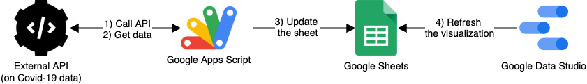

- project start date = 19/09/2020
- a visualization speaks a thousand words

 

Presentation
============

We present a synthetic visualization on the COVID-19 pandemic cases and deaths evolution.
The data source is available for download [here](https://data.europa.eu/euodp/en/data/dataset/covid-19-coronavirus-data)
or through a public API [here](https://covid19api.com/).

    <iframe class="embed-responsive-item" src="https://datastudio.google.com/embed/reporting/ff0b1d84-5754-4ec1-813c-391506603950/page/QHggB" allowfullscreen></iframe>

 

Architecture
============

We present the architecture and data pipeline briefly.
First, we connect to the a public API in order to retrieve the data and process it.
Then, we update a sheet with latest available data in a daily basis.
Finally, the visualization is refreshed with the updated version of the data.

<figure class="text-center">
  
  <figcaption class="figure-caption">Architecture and data pipeline.</figcaption>
</figure>
